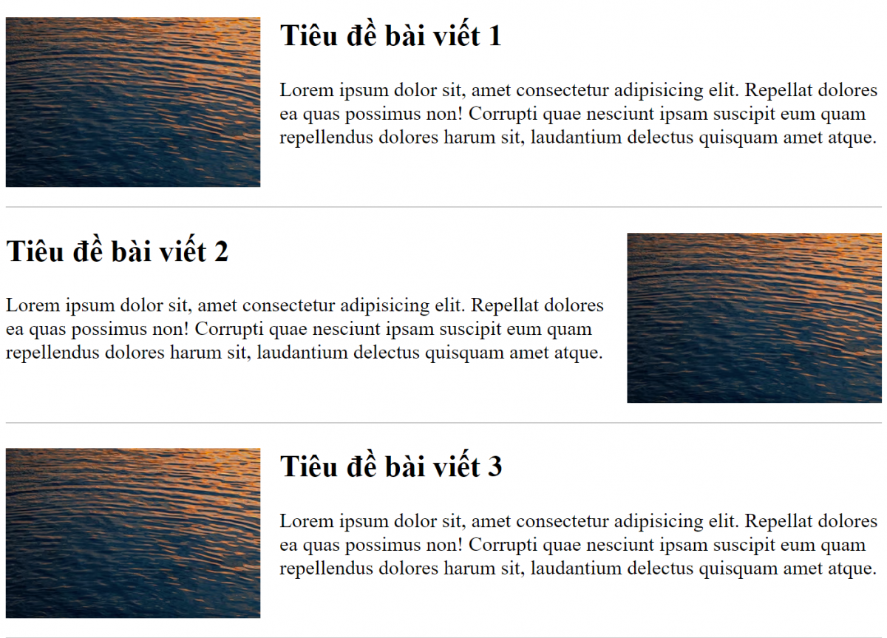

# Bài tập buổi 08

## Bài 1:

### Bài tập: Trò chơi đoán số bí mật 🎲

#### **Yêu cầu:**

1. Máy tính chọn ngẫu nhiên một số nguyên trong khoảng từ 1 đến 100 (sử dụng `Math.random()` và `Math.floor()`).
2. Người chơi nhập dự đoán qua `prompt()`.
3. Nếu số nhập vào lớn hơn số bí mật, chương trình hiển thị `"Số bạn đoán quá lớn!"`.
4. Nếu số nhập vào nhỏ hơn số bí mật, chương trình hiển thị `"Số bạn đoán quá nhỏ!"`.
5. Nếu đoán đúng, chương trình hiển thị `"Chúc mừng! Bạn đã đoán đúng số bí mật!"` và kết thúc trò chơi.
6. Người chơi có tối đa 7 lần đoán. Nếu hết lượt mà vẫn chưa đoán đúng, chương trình thông báo `"Bạn đã thua! Số bí mật là X"` và kết thúc trò chơi.

#### **Gợi ý:**

- Dùng `Math.random()` để tạo số ngẫu nhiên từ 1 đến 100.
- Dùng `prompt()` để lấy dữ liệu đầu vào từ người chơi.
- Dùng `alert()` để hiển thị thông báo.
- Dùng vòng lặp `for` hoặc `while` để giới hạn số lượt đoán.

## Bài 2:

**Dựa vào hình ảnh giao diện sau, hãy thiết kế 1 mảng phù hợp và thực hiện đổ dữ liệu lên giao diện**

